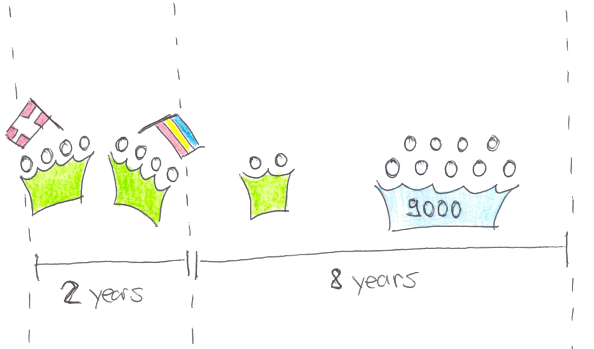
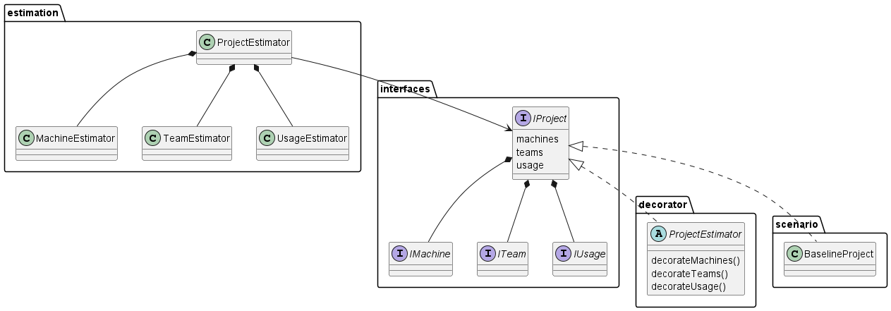

# Environmental Impact of Software Estimator

## Purpose

This tool estimates the carbon footprint for a hypothetical, average business software project.
A set of decorators allows to play around to see the impact of different emission reduction measures.

## Disclaimer

This estimator uses a pragmatic approach to get a rough understanding.
Is is in no way intended to be scientific and might have major flaws.

## Getting started

The easiest way to start is to run and adopt `AllDecorators` in the `api` project.

1. Clone repo
2. `cd api`
3. `npm i`
4. `npm run test -- AllDecorators.test.ts`
5. Inspect the console log. You'll see the estimates for the baseline plus the decorated (aka. optimized) version. It's a CSV, so for advanced analysis, copy it to Excel.

### Starting the web frontend

There's a frontend, but not much visible there.

1. Clone repo
2. `cd api`
3. `npm i`
4. `npm start`
5. `cd ../web`
6. `npm i`
7. `npm run dev`
8. Open given URL in browser. You will not yet see much though.

## Scenario

The emissions are estimated for an "average enterprise software project". Here's a description of the project at hand:

The software is developed by 8 developers during 2 years. The developers work in a near-shoring setup and the whole teams comes together every 6 weeks.

After the software is developed it is maintained by 2 developers until the end of life of the software which is after 8 years.
The maintenance team does not use near-shoring.

The software is used by 9000 users distributed across Europe.
Each user uses the software during 1h per business day during 8 years.

The usage is equally distributed over the day - except for the time between 11 and 14 o'clock where the load is doubled.

The application is a single page application served by a web-server which gets the data from a database-server.
A job-server takes care of long-running jobs.

## Repository Structure

* `/api` contains an Express REST endpoint with the estimation logic
* `/web` contains a React user interface
* `/talks` contains preparation files to present the findings

### API

